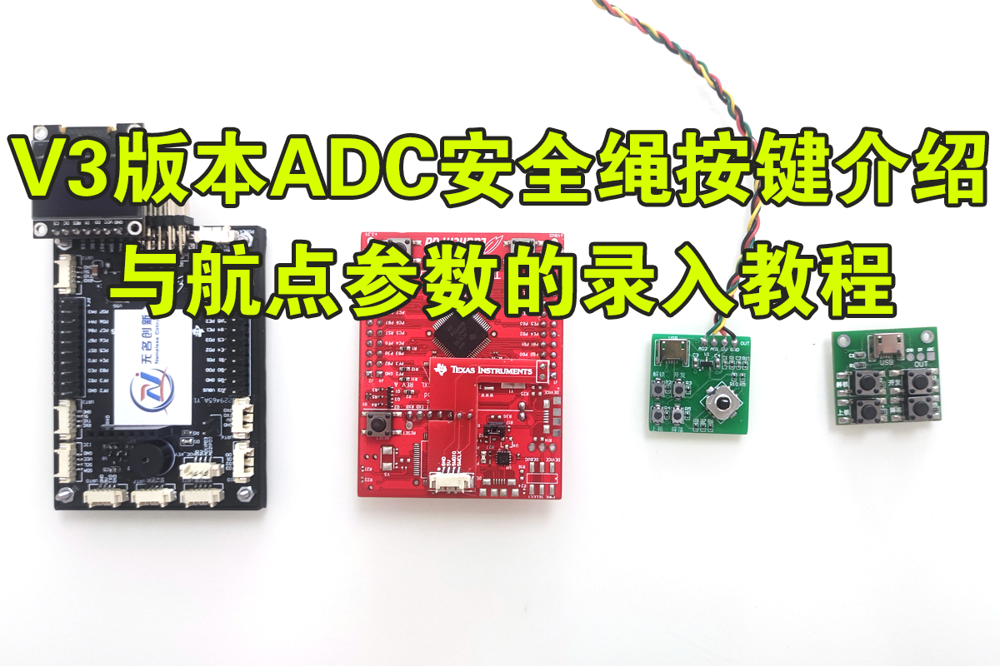
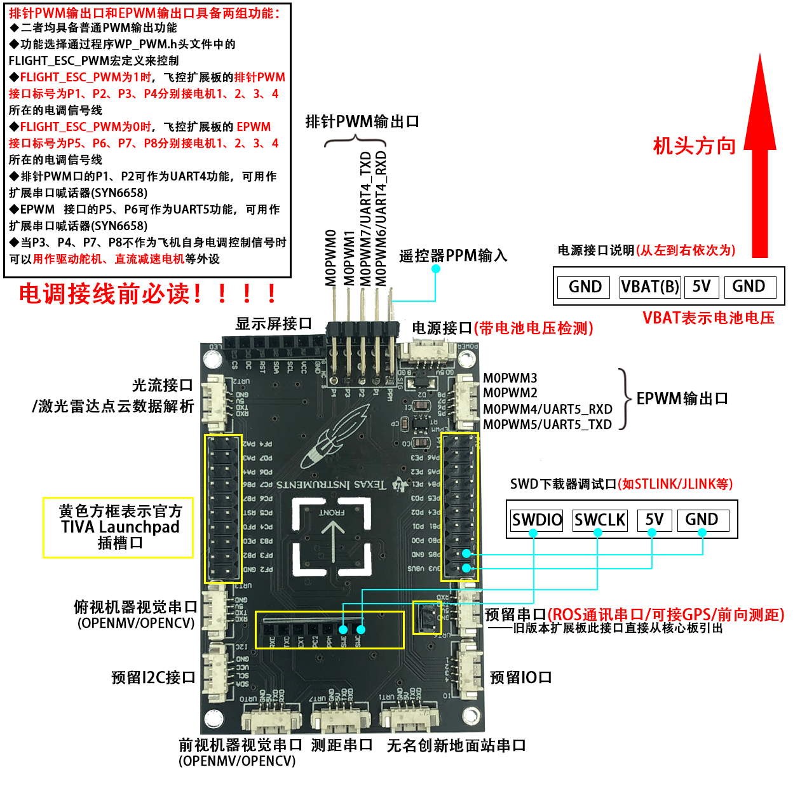
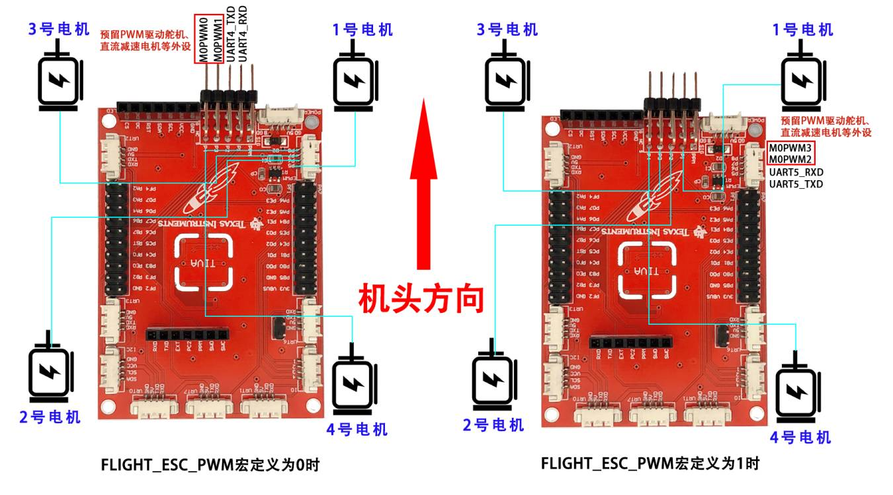

# TIVA LaunchPad V3版本飞控代码阶段性更新日志：

## **20231130主要更新如下**

### 1、针对NC360动力套装中大疆精灵3 原装螺旋桨缺货，由于厂家全线停产导致断货问题，市面上9450自锁桨同规格参数的产品有十余种，不同厂家的螺旋桨动、静平衡性能方面差异比较大，特别是高转速的情况下，某些厂家的螺旋桨抖动非常严重，因此在使用某些厂家的螺旋桨，*<u>用旧版本代码</u>*在飞行性能上无法做到参数兼容，需要有一定飞控基础的用户对参数进行一定的调整去适配。

### 2、为了方便零基础用户选择低成本的备用替代桨叶，本次更新的代码在滤波、融合、控制等参数上做了整体优化，在使用默认参数的情况下，使用几元到几十元的9450、9443、9545、1045、1046等相近规格的螺旋桨能都获得的不错的飞行体验，<u>*有条件的用户推荐在竞赛时仍然使用精灵3原厂桨叶，副厂桨叶仅在平时训练中使用。*</u>

### 3、将加速度计、陀螺仪传感器采样频率提高到了1000Hz，能有效减少传感器低通滤波时的时延，提高了数据的实时性，并且能提高低成本IMU在高频段的数据噪声抑制表现，增加了飞控在不同轴距、不同动力配置、不同工况噪声条件下的适用性。

### 4、增加了通过飞控板载独立按键/ADC按键直接对姿态环（角度、角速度）控制PID参数进行设置，无需通过地面站或者修改代码就能实现控制参数的快速调整。

### 5、针对深度专业玩家的客制化服务，可以通过飞控板载独立按键/ADC按键对姿态解算中的陀螺仪和加速度、惯导加速度、反馈加速度等相关滤波参数进行修改，普通玩家用默认参数就可以获得满足竞赛要求的飞行性能。

### 6、在飞控显示屏系统设置界面，新增加了通过板载按键去恢复出厂设置功能，飞控在下载了不同版本代码更新时需要先恢复出厂设置后再使用。

### 7、在宇树科技3D雷达工作情况下，引入了带阻滤波器，能对雷达转动造成的无人机IMU特定频段的噪声进行了滤除。

## **20230820主要更新如下**

### 1、增加了2023年TI电子设计竞赛G题空地协同智能消防系统基础+发挥部分，国一得奖标准复现学习训练方案

##### https://www.bilibili.com/video/BV17z4y1P7pf/

##### https://blog.csdn.net/u011992534/article/details/133386366

### 2、增加了通过无线数传发送ADC按键数据的代码，实现通过小车上的按键对无人机的启动

##### https://www.bilibili.com/video/BV1vh4y1w7DP/

### 3、增加了舵机控制机械手夹取、释放动作行程标定代码，方便用户快速扩展舵机外设

##### https://www.bilibili.com/video/BV1dC4y1E7ML/

### 4、高度观测传感器新增了对面阵激光测距传感器TOFSense-M的支持，方便用户灵活处理去处理飞机底部出现遮挡、地面出现抬升等距离观测变化时的情形

##### https://www.bilibili.com/video/BV1az4y147NG/

### 5、优化了高度控制函数，在SDK自动飞行时对期望的竖直加速度值进行了单独的限幅，避免初始大的高度位置偏差，导致起飞过快引起的初始位置偏移，使SDK控制下的得起飞过程更加平稳和安全

### 6、增加了以RK3588S平台的机载计算机平台，适配宇树科技4D L1激光雷达，运行FAST_LIO/Point-LIO算法的室内/外定位方案，使用3维全向超广角雷达方案能更好的适应比赛中地面纯色少纹理、光线变化等场景

### 7、利用雷达惯性里程计系统能高质量的输出全局地图的位姿信息，相较于普通光流定点的方式中的"痛点"问题，本定位方案具有环境适应能力强、输出当前环境的绝对位置信息定位误差不随时间累计漂移的优势，传统竞赛方案中光线、背景等不利因素均可以迎刃而解，参赛队伍可以实现位置的全局闭环控制，学生可以逐渐摒弃以往不完备的半开环、挑环境、部分靠运气成分的"盲飞"比赛方案。

### 8、可以输出航向信息，能解决传统方案中无磁力计融合航向累计漂移、有磁力计融合时，在低空或部分磁场干扰环境影响航向对准问题。

### 9、同时相较于二维激光雷达/深度相机等定位方案，使用3维激光雷达主要有以下几个明显的优点

- #### 能更好的适用大场景比如体育馆、空旷的教室、少视觉特征点等环境下的全局定位

- #### 能避免二维雷达在高度发生变化的情况下，不同高度上的环境反射发生变化时的造成的位置误差

- #### 雷达惯性里程计系统能有效避免在二维激光雷达建图时的偏航角速度运动过快时的SLAM建图跑飞、数据发散等情形，前者在无人机这一平台上适用性更高、更可靠

- #### FAST_LIO/Point-LIO算法相较于传统hector/cartographer算法，能满足无人机在大机动、快速状态下的稳定定位

- #### 雷达惯性里程计系统能输出高度数据，可以替代对地传感器传感器用于无人机定高，在底部安装了机械手、抬升等装置，容易干扰对地测距传感器数据的情况下（如工程实践与创新能力大赛底部安装多个投放装置时），可以用雷达惯性里程计系统输出的高度数据实现稳定的定高

  ##### https://www.bilibili.com/video/BV1hu4y1W7Hj/

  ##### https://www.bilibili.com/video/BV1d94y1573A/

  

## **20230620主要更新如下**

### 1、增加了V3版本ADC按键代码支持

### 2、增加了用户可以通过ADC按键录入自定义航点数据，支持现场设置坐标参数

### 3、增加了航点自动飞行功能软件设计，在激光雷达SLAM/T265定位条件下，实现无人机的指哪打哪

电赛神器——V3版本ADC安全绳按键介绍与航点参数的录入教程(无遥控器控制方案)
		https://www.bilibili.com/video/BV1Q14y1U7uz

 12_用户通过ADC按键录入自定义航点飞行功能——支持现场设置坐标参数，全局定位，指哪打哪
		https://www.bilibili.com/video/BV1wP411z7jo

## **20220805主要更新如下**

### 1、增加了2022年7月TI省赛B题送货无人机赛题的支持

赛题要求第一部分：2022年TI电赛B题—送货无人机开源方案NC360深度开源竞赛无人机开发平台

https://www.bilibili.com/video/BV1PB4y1t7eM/?vd_source=fa3e626a57e95e09ecf1b8f1627e58ac

赛题要求第二部分：TI电赛飞行器-B题送货无人机模板目标特征学习

https://www.bilibili.com/video/BV1kg411C76u/?vd_source=fa3e626a57e95e09ecf1b8f1627e58ac

赛题要求第三部分：任意位置、角度自主飞行穿越圆框——2022年TI电赛飞行器B题送货无人机

https://www.bilibili.com/video/BV14S4y1474j/?vd_source=fa3e626a57e95e09ecf1b8f1627e58ac

- 针对赛题内容需要**驱动舵机或者减速电机**，对PWM资源进行了重新分类，**预留两路PWM**用于驱动舵机、减速电机等执行机构。

- 同时将原来预留四路PWM中的**两路资源删除掉了**，**新增加了一路串口资源UART4/UART5**，此串口资源可以**接串口语音模块外接功放喇叭实现喊话器**的功能，**通过WP_PWM.h头文件中的FLIGHT_ESC_PWM宏定义控制。**

  

  //飞控电调所接PWM来源
  #define FLIGHT_ESC_PWM  0//**0:使用EPWM、1:使用排针PWM**

  | 飞控扩展板上标号 | 单片机引脚号 | 单片机PWM资源通道 |   第二功能   |
  | :--------------: | :----------: | :---------------: | :----------: |
  |        P1        |     PC4      |      M0PWM6       |  UART4_RXD   |
  |        P2        |     PC5      |      M0PWM7       |  UART4_TXD   |
  |        P3        |     PB7      |      M0PWM1       | 预留PWM通道1 |
  |        P4        |     PB6      |      M0PWM0       | 预留PWM通道2 |
  |        P5        |     PE5      |      M0PWM5       |  UART5_TXD   |
  |        P6        |     PE4      |      M0PWM4       |  UART5_RXD   |
  |        P7        |     PB4      |      M0PWM2       | 预留PWM通道1 |
  |        P8        |     PB5      |      M0PWM3       | 预留PWM通道2 |

  FLIGHT_ESC_PWM  **宏定义为0，飞控电调信号使用EPWM接口**
  飞控扩展板的EPWM接口标号为P5、P6、P7、P8分别接电机1、2、3、4所在的电调信号线

  | 电调/舵机信号序号 | 飞控扩展板上标号 | 单片机引脚号 | 单片机PWM资源通道 |
  | :---------------: | :--------------: | :----------: | :---------------: |
  |      MOTOR1       |        P5        |     PE5      |      M0PWM5       |
  |      MOTOR2       |        P6        |     PE4      |      M0PWM4       |
  |      MOTOR3       |        P7        |     PB4      |      M0PWM2       |
  |      MOTOR4       |        P8        |     PB5      |      M0PWM3       |
  | **预留PWM通道1**  |      **P3**      |   **PB7**    |    **M0PWM1**     |
  | **预留PWM通道2**  |      **P4**      |   **PB6**    |    **M0PWM0**     |

  1. 两个通道预留PWM分别为**排针PWM接口的P3、P4**
  2. 排针PWM接口的P1、P2被用作**串口资源的UART4_RXD、UART_TXD**

  

  FLIGHT_ESC_PWM **宏定义为1，飞控电调信号使用排针PWM接口**
  飞控扩展板的排针PWM接口标号为P1、P2、P3、P4分别接电机1、2、3、4所在的电调信号线

  | 电调/舵机信号序号 | 飞控扩展板上标号 | 单片机引脚号 | 单片机PWM资源通道 |
  | :---------------: | :--------------: | :----------: | :---------------: |
  |      MOTOR1       |        P1        |     PC4      |      M0PWM6       |
  |      MOTOR2       |        P2        |     PC5      |      M0PWM7       |
  |      MOTOR3       |        P3        |     PB7      |      M0PWM1       |
  |      MOTOR4       |        P4        |     PB6      |      M0PWM0       |
  | **预留PWM通道1**  |      **P7**      |   **PB4**    |    **M0PWM2**     |
  | **预留PWM通道2**  |      **P8**      |   **PB5**    |    **M0PWM3**     |

  1. 两个通道**预留PWM**分别为**EPWM接口的P7、P8**
  2. EPWM接口接口的**P5、P6被用作串口资源的UART5_TXD、UART5_RXD**

- 针对赛题中需要在比赛现场通过**板载按键来对目标作业点坐标进行配置**，在OLED显示屏上新加了相关配置UI界面，配合TIVA核心板上的按键上一页、下一页**长按实现对相关参数进行调整**。同理也可以通过按键对第二个任务中**模板特征信息学习后进行存储**。相关操作教程见下方链接：

  [https://www.bilibili.com/video/BV1PB4y1t7y9?spm_id_from=333.999.0.0&vd_source=fa3e626a57e95e09ecf1b8f1627e58ac](https://www.bilibili.com/video/BV1PB4y1t7y9?spm_id_from=333.999.0.0&vd_source=fa3e626a57e95e09ecf1b8f1627e58ac)

## **20220705主要更新如下**

### 1、增加了旧版本SDK任务接口函数，在搭载激光雷达SLAM定位时的支持

- 针对**以往室内定位只支持光流定点时（2022年前）**，代码中的旧版本sdk接口函数仍然保留，该部分**sdk在光流定位有效时使用**，即SDK1_Mode_Setup=0时，执行NCQ_SDK_Run()任务。

- 新版本代码在搭载激光雷达时，**已经支持了更为高效的导航控制函数+基础飞行控制函数为框架的积木式编程二次开发函数**，代码中仍然对旧的sdk函数保留，目的是为了**兼顾因经费原因暂时没用上激光雷达**的学习者。

- **本次升级旨在解决旧版本sdk任务中只支持普通光流定位的情况，现也对搭载激光雷达定位时予以了支持，即搭载激光雷达slam定位时也能采用旧版本sdk接口函数编写飞行任务。（虽然此方式已不再被推荐）**

## **20220430主要更新如下**

### 1、增加了飞控串口直接解析2D激光雷达传感器数据、OLED激光雷达点云数据显示，方便后续处理避障、绕障飞行

### 2、增加了飞控端复位机载计算机的激光雷达SLAM建图指令，可以直接通过飞控设置导航原点，避免了在无显示屏、无远程登录条件下的树莓派开机自启动等待过程

### 3、无人机地面站升级到了V1.0.6版本，新增加了3D轨迹显示，3维模型显示、预留参数、串口控制指令配合导航控制函数飞行等

### 4、增加了一组飞控任务调度定时器处理地面站发送数据，并调整了ROS通讯串口、两路视觉通讯串口的波特率和中断优先级，增加了数据实时性和通讯的可靠性

### 5、配合NC360机架，增加了IO蜂鸣器驱动，用于低压报警、飞控准备就位指示

### 6、机载计算机端新增cmd_vel、cmd_pos等控制接口，可以使用机载计算机键盘直接控制无人机飞行

### 7、通过导航控制函数与串口控制指令配合，用户二次开发飞行任务的代码编写，既可以在飞控单片机端编程实现，也可以在机载计算机端编程实现......

## **20220301主要更新如下**

### **1、支持了树莓派机载计算机平台**

### **2、支持了OPENCV机器视觉**

### **3、增加了ROS激光雷达、T265双目相机定位功能**

### **4、增加了飞控作为ROS端IMU姿态数据来源**

### 5、支持了机载计算机控制飞控自动轨迹飞行demo

### **6、增加了利用AprilTag定位代码，实现输出空间三维位姿数据**

### **7、增加了SDK数据帧内容**

### **8、增加了导航控制函数，初学者可以高效率实现搭积木式编程**

### **9、丰富了姿态偏航控制模式，绝对、相对角度、角速度控制**

### **10、增加了2021年电赛植保无人机，基础+发挥部分完整方案供客户学习**......

## 20210730主要更新如下

### 1、程序兼容市面上QMC/HMC5883两款磁力计（客户可以不用关心自己手头磁力计具体是哪个型号，飞控自动识别）

### 2、增加了新版ADC按键支持

### 3、增加按键直接校准机架水平、磁力计等功能......

## 20210630主要更新如下

### 1、SDK开发者模式中，增加电赛赛题元素绕杆功能。

### 2、测距串口最大可支持10个tofsense激光级联，可用作前向测距，辅助绕杆（建议前向至少4个）

### 3、增加利用飞控板载按键，直接校准加速度计、磁力计传感器......

## 20210601主要更新如下

### 1、飞控核心代码全部开放，国内首创的全系列开源飞控产品：飞控、地面站、遥控器、数传、机器视觉，培养客户成为全栈工程师

### 2、增加了一组前向视觉OPENMV，用于实现前向追踪、避障

### 3、增加了一组测距传感器TOFSense，死区1cm，最大测量高度5m，推荐预算够的学校首选此模式；

### 4、增加了一组ADC按键，用于外接安全绳和按键，实现电赛比赛要求的无遥控器按键控制，本方案全网开源，可以自行参考设计

### 5、优化程序控制逻辑，SDK运行模式可以通过板载按键选择

### 6、增加电赛专用的用户开发者模式，飞控控制逻辑、操作方法和MSP432版本一致，方便用户跨平台开发；

### 7、配套OPENMV视觉处理代码，可以利用UART1外接测距传感器TOF，同时增加了AprilTag等特征识别例程

### 8、优化了ICM20689传感器滤波参数，增加了数据的实时性与抗震能力，提高了控制参数兼容性，同时对IMU温控系统、着陆检查、SDK解析等细节部分进行了优化......

## 20200520主要更新如下

### 1、配合无名创新开源遥控器，GPS模式下支持指点飞行、自动跟踪模式等

### 2、增加NCLINK部分协议，如SDK位移控制、校准等

#### 地面站教程：https://www.bilibili.com/video/BV1JE411c7vU?from=search&seid=9299696561323162336

### 3、精简飞控上层控制逻辑，结构更新清晰

### 4、飞控新增支持光流GL9306模块

### 5、对地传感器新增激光传感器VL53L1X

### 6、新增磁力计支持MMC3630

### 7、优化返航点刷新逻辑，提高自动返航精度......